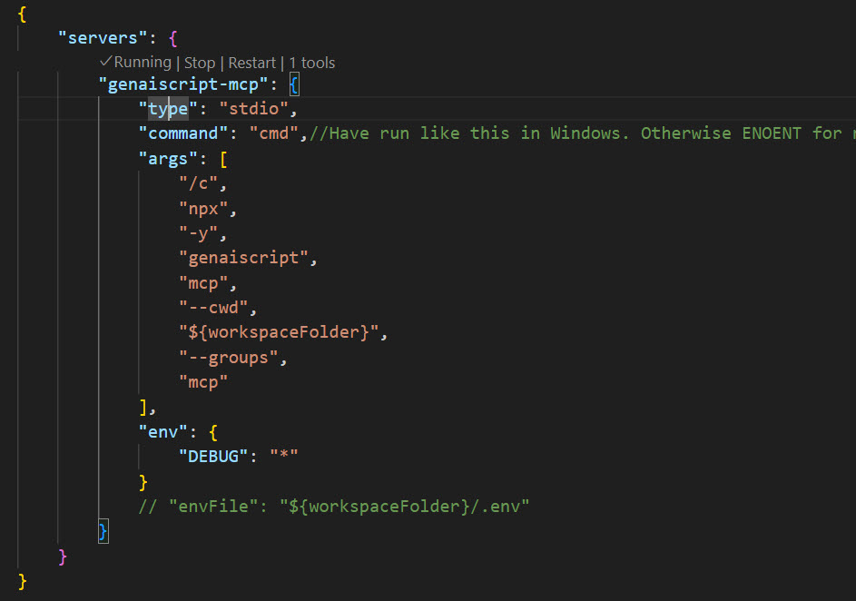
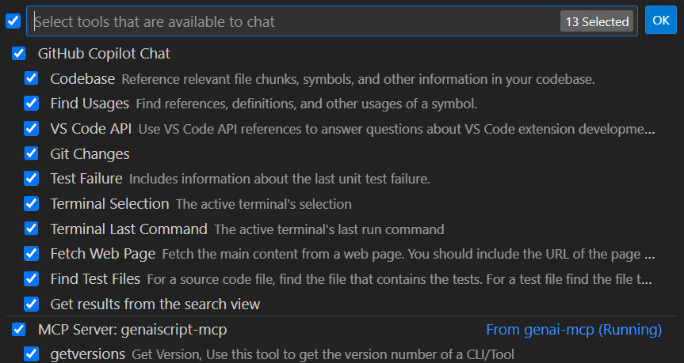
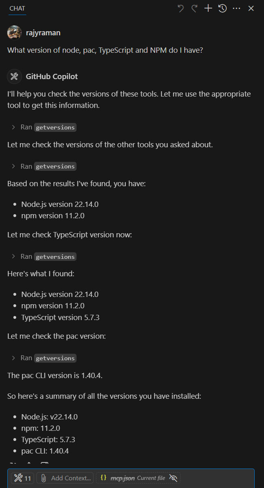

# GenAIScript MCP Demo 🚀

This repository demonstrates the MCP Server capabilities of GenAIScript. The minimum version you need is `1.119.4`

## What is GenAIScript? 🤖

GenAIScript is a framework that enables you to communicate with AI models (even local models). GenAIScript can use MCP tools, and can also act as the MCP server.

## Model Context Protocol (MCP) 📋

This is how Anthropic, the creators of MCP specification, defines [Model Context Protocol](https://modelcontextprotocol.io/introduction)

> MCP is an open protocol that standardizes how applications provide context to LLMs. Think of MCP like a USB-C port for AI applications. Just as USB-C provides a standardized way to connect your devices to various peripherals and accessories, MCP provides a standardized way to connect AI models to different data sources and tools.

## Installation of GenAIScript 🛠️

Install the VSCode extension. You need at least Node.js v20. Refer to https://microsoft.github.io/genaiscript/getting-started/installation/ additional instructions. 

## Usage 💻

If you install the March 2025 version of VSCode Insiders, you should be able to run the GenAIScript MCP server locally, to get the tool versions installed on your local machine.

[mcp.json](./.vscode/mcp.json) is where you would configure the MCP servers. Below is the sample configuration on Windows.

```json
{
    "servers": {
        "genaiscript": {
            "type": "stdio",
            "command": "cmd",//Have run like this in Windows. Otherwise ENOENT for npx, atleast in my machine.
            "args": [
                "/c",
                "npx",
                "-y",
                "genaiscript",
                "mcp",
                "--cwd",
                "${workspaceFolder}",
                "--groups",
                "mcp"
            ],
            "env": {
                "DEBUG": "*"
            }
            // "envFile": "${workspaceFolder}/.env"
        }
    }
}
```
You can start the MCP Server by clicking the Start link. If it is already running, you would see a Running indicator.





Below is how you can use it in the GitHub Copilot chat.


